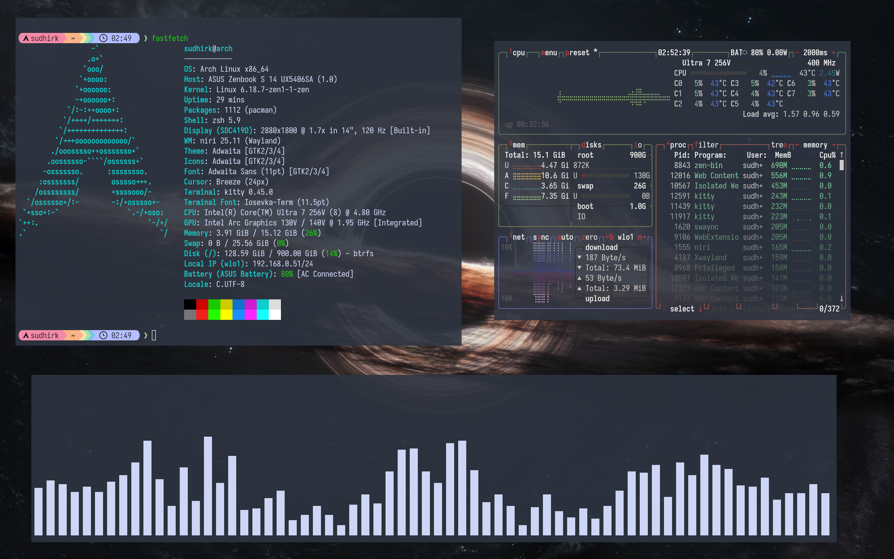
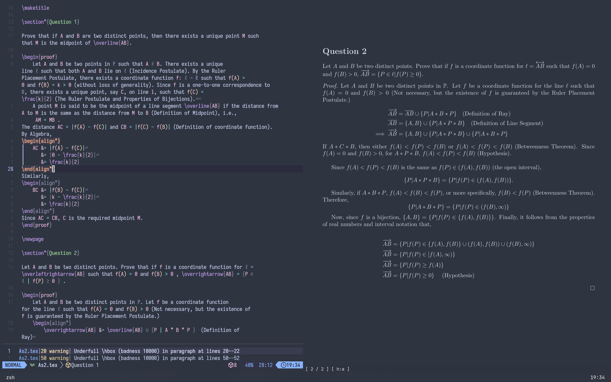

# Minimalist Niri Rice 

Very minimal catppuccin-adjacent rice. Screw OLEDs.

Inspired by [Gilles Castel](https://castel.dev/post/lecture-notes-1/)

## Screenshots

## Software

| Tool | Application |
|:-----------:|:----:|
| Distro | Arch (btw) |
| Window Manager | Niri |
| Status Bar | Waybar |
| Wallpaper | swaybg |
| Resource Monitor | btop |
| Lock Screen | swaylock |
| Idle Daemon | hypridle |
| Notification Manager | swaync |
| File Manager | yazi |
| App Launcher | vicinae |

| Terminal Stuff | Application |
|:--------------:|:------------:|
|Terminal Emulator|Kitty|
|Shell|zsh|
|Prompt|starship|
|Editor|Neo(Lazy)vim|
